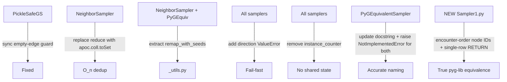

# Sampler Bug-Fix Review & Production Hardening

## Verification of Previous Changes

### Fix 1 — CALL block aggregation (NeighborSampler) — Correct

The critical bug was that `UNWIND frontier AS src` produced one row per frontier node and the CALL never collapsed back to a single row. The fix adds `apoc.coll.flatten(collect(...))` immediately after the per-src list computation, mirroring `PyGEquivalentSampler`. This is the correct pattern and no regression is introduced.

### Fix 2 — "Take all" rule (NeighborSampler) — Correct

The pyg-lib C++ kernel has an explicit early-return when `count < 0 || (!replace && count >= population)`. The CASE expression in the Cypher now implements the same rule. Verified: `false = false` and `true = false` resolve to the correct Cypher booleans at runtime.

### Fix 3 — `collect(r)` vs `collect({nbr, rid: r.id})` — Correct

Collecting relationship objects directly (`collect(r) AS cand_rels`) is the right approach. The old `r.id` was a user-defined property (not Neo4j's internal element ID) and would be `null` for most relationships, breaking parallel-edge deduplication.

### Fix 4 — Isolated seed index remapping (both samplers) — Correct

Traced through a concrete example:

- `unique_nodes = [2, 5, 7]`, `edge_index_local = [[0,1],[1,2]]`, `seeds = [3, 5]`
- `all_nodes = [2, 3, 5, 7]` — node 3 inserted, shifts 5→index 2, 7→index 3
- `old_to_new` maps global IDs → new local indices
- `global_edge = unique_nodes[edge_index_local]` recovers global IDs `[[2,5],[5,7]]`
- `old_to_new[global_edge]` correctly produces `[[0,2],[2,3]]`

### Fix 5 — Empty edge guard (BaseLineGS) — Correct but analysis revised

The original code with `torch.tensor([], dtype=torch.long).t().view(2,-1)` does **not** actually crash (a 0-element tensor can be viewed as `[2,0]`). The guard is therefore defensive/cosmetic rather than a crash fix. It is still cleaner and should be kept.

---

## Regression Found: `PickleSafeGS` Not Updated

`[src/neo4j_pyg/graph_stores/PickleSafeGS.py](src/neo4j_pyg/graph_stores/PickleSafeGS.py)` has its own `sample_from_nodes` with the old pattern (no defensive empty guard, tensor operations inside the session context). It needs the same defensive empty-edge handling applied to `BaseLineGS`.

```python
# PickleSafeGS current (line 87-96) — old pattern, inconsistent with BaseLineGS
def sample_from_nodes(self, kwargs, query: str):
    with self._get_driver().session(...) as session:
        result = session.run(query, **kwargs)
        edges = [[r["src"], r["dst"]] for r in result]
        edge_index_global = torch.tensor(edges, ...).t().contiguous()  # inside session
    unique_nodes, local_indices = torch.unique(...)
    ...
```

Fix: consume `edges` inside the session, move all tensor operations outside, and add the empty-edge guard identically to `BaseLineGS`.

---

## Performance Issue: O(n²) `reduce` Deduplication in NeighborSampler

`NeighborSampler` uses the same order-preserving `reduce` as `PyGEquivalentSampler`:

```cypher
reduce(acc = [], n IN next_frontier_raw |
    CASE WHEN n IN acc THEN acc ELSE acc + [n] END
) AS next_frontier
```

`n IN acc` is O(n) per element → O(n²) overall. `PyGEquivalentSampler` and the new `Sampler1` both require `reduce` for deterministic ordering. `NeighborSampler` makes no ordering guarantee, so it can use the O(n) set function:

```cypher
apoc.coll.toSet(next_frontier_raw) AS next_frontier
```

---

## Why `PyGEquivalentSampler` Is Not Actually Equivalent

The name is misleading. There are two concrete reasons:

**1. Sorted vs encounter-order node IDs**

pyg-lib assigns local node IDs via a hash-map (`Mapper`) in insertion order: seeds get IDs `0..B-1`, then each newly-encountered neighbor gets the next available ID. The resulting `out_node_id` is in encounter order.

`PyGEquivalentSampler` relies on `BaseLineGS.sample_from_nodes`, which calls `torch.unique(edge_index_global)`. `torch.unique` sorts by global ID value. The local indices are therefore **sorted positions**, not encounter positions. Example:

```
pyg-lib:  seeds=[100, 5], hop-1 new=[42, 7]  → out_node_id = [100, 5, 42, 7]
PyGEquiv: same seeds + neighbors              → unique_nodes = [5, 7, 42, 100]  (sorted)
```

For GNN training accuracy this does NOT matter — `Training.py` uses `torch.isin(batch.n_id, batch.input_id)` which is order-agnostic. But structurally the outputs are different.

**2. "both" direction broken property access**

For `direction='both'`, the generated Cypher has `(CASE WHEN startNode(rel) = src THEN endNode(rel) ELSE startNode(rel) END).id`, which may not be valid Cypher (property access on a CASE expression). The docstring says "should not happen" but fails silently instead of raising. Fix: raise `NotImplementedError` for `direction='both'`.

**What `PyGEquivalentSampler` does correctly** (keep all of this):

- `direction='incoming'` for CSC-format sampling matching pyg-lib
- `ORDER BY i` and `UNWIND range(...)` for stable frontier ordering
- `reduce` for order-preserving unique of new frontier nodes
- Records ALL edges (including to already-visited nodes)
- "Take all" rule when `k >= population`
- Correct `collect(r)` relationship sampling

The rename and doc update should reflect: "semantically correct for GNN training, not structurally identical to pyg-lib output format."

---

## New File: `Sampler1.py` — Truly Equivalent to pyg-lib

`Sampler1.py` matches pyg-lib `NeighborLoader` with `replace=False`, `disjoint=False`, `subgraph_type="directional"` (CSC, incoming edges). The key difference from `PyGEquivalentSampler` is the Python mapping layer.

### Cypher design

Same hop-by-hop structure as `PyGEquivalentSampler` (order-preserving with `ORDER BY i` and `reduce`), but with a different RETURN clause that exposes the encounter-ordered node list directly:

```cypher
-- final RETURN (replaces the UNWIND edges AS e approach)
RETURN
    [n IN visited | n.{nodeid_property}] AS ordered_nodes,
    [e IN edges   | [e.src_id, e.dst_id]] AS edge_pairs
```

This returns a **single row** with two lists, avoiding any re-ordering by the driver or `torch.unique`.

### Python mapping

```python
record = result.single()
ordered_global_ids = torch.tensor(record["ordered_nodes"], dtype=torch.long)
edge_pairs = record["edge_pairs"]          # list of [src_global, dst_global]

# Encounter-order mapping — mirrors pyg-lib Mapper insertion order
global_to_local = {gid: i for i, gid in enumerate(ordered_global_ids.tolist())}

if edge_pairs:
    row = torch.tensor([global_to_local[e[0]] for e in edge_pairs], dtype=torch.long)
    col = torch.tensor([global_to_local[e[1]] for e in edge_pairs], dtype=torch.long)
else:
    row = col = torch.zeros(0, dtype=torch.long)
```

Seeds are always in `visited` from the initial `WITH collect(s) AS visited`, so `ordered_global_ids` always contains all seeds — **no isolated-seed remap needed**. `Sampler1` does not use `BaseLineGS.sample_from_nodes` for node mapping; it calls `graph_store.driver.session().run(query)` (or a new thin `graph_store.run_query(query, kwargs)` method) directly.

### Structural equivalence properties


| Property                  | pyg-lib      | Sampler1     | PyGEquivalentSampler |
| ------------------------- | ------------ | ------------ | -------------------- |
| Seeds first in `n_id`     | Yes          | Yes          | No (sorted)          |
| Encounter-order new nodes | Yes          | Yes          | No (sorted)          |
| All edges recorded        | Yes          | Yes          | Yes                  |
| Take-all rule             | Yes          | Yes          | Yes                  |
| Incoming (CSC) direction  | Yes          | Yes          | Yes                  |
| Order-preserving frontier | Yes (mapper) | Yes (reduce) | Yes (reduce)         |


---

## Further Production-Readiness Improvements

**1. Deduplicate shared Python logic** — `sample_from_nodes` and the isolated-seed remapping block are copy-pasted identically between `NeighborSampler` and `PyGEquivalentSampler`. Extract to a shared module-level helper:

```python
# neo4j_pyg/samplers/_utils.py
def remap_with_seeds(unique_nodes, edge_index_local, seeds):
    all_nodes = torch.unique(torch.cat([unique_nodes, seeds]))
    if all_nodes.shape[0] != unique_nodes.shape[0] and edge_index_local.numel() > 0:
        old_to_new = torch.zeros(all_nodes.max().item() + 1, dtype=torch.long)
        old_to_new[all_nodes] = torch.arange(all_nodes.shape[0])
        edge_index_local = old_to_new[unique_nodes[edge_index_local]]
    return all_nodes, edge_index_local
```

`Sampler1` does NOT need this helper (it builds its own encounter-order mapping).

**2. Add `direction` validation** — a typo silently falls through to `else` ("both"). Add a check at `__init__` in all samplers:

```python
if self.direction not in ("incoming", "outgoing", "both"):
    raise ValueError(f"direction must be 'incoming', 'outgoing', or 'both', got {self.direction!r}")
```

**3. Remove the `_instance_counter` class variable** — shared mutable state, non-deterministic IDs in multi-process settings. Use `id(self)` if a debug identifier is ever needed.

**4. `PyGEquivalentSampler` "both" direction** — raise `NotImplementedError` for `direction='both'` since the generated Cypher property-access expression `(CASE WHEN ... END).id` is potentially invalid.

---

## Summary of Changes




